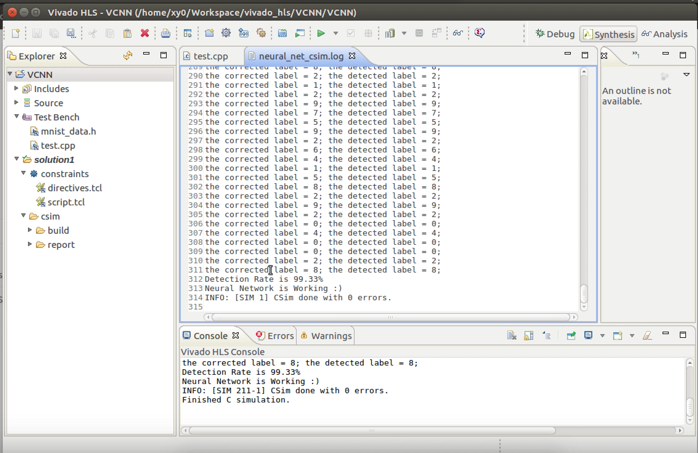

# Vivado HLS Convolution Neural Network Framework #

> Proof of concept, has synthesis problem because of
> - pointer inside struct
> - function pointer

A convolutional neural network framework implemented in Vivado HLS C, support to translate simple caffe model into C and run in FPGA. 

[[demo video](https://www.youtube.com/watch?v=YNWhBHvy6JI)]

## Usage

1. Translate a model: [How to translate a trained caffe model link](https://github.com/BenBBear/vcnn-caffe-convertor)
2. Put the generated caffe\_model\_layer.cpp, caffe\_model\_layer.h into [src/custom/](src/custom/)
3. Modify [src/custom/test.cpp](src/custom/test.cpp) 
4. Open Vivado HLS and open project on the top folder, then run simulation. 

